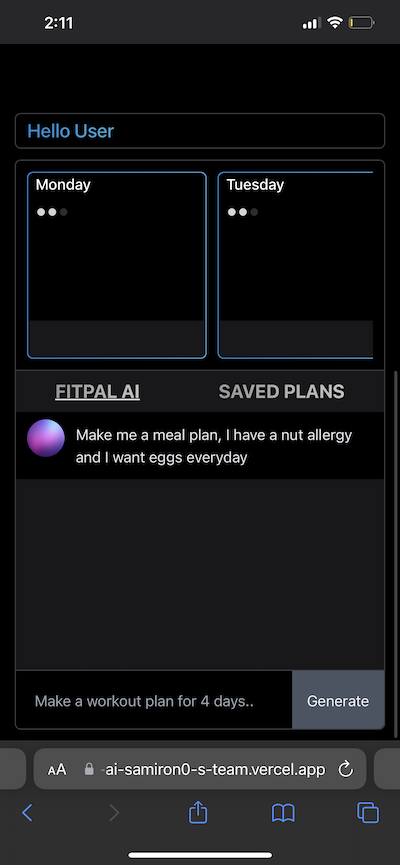
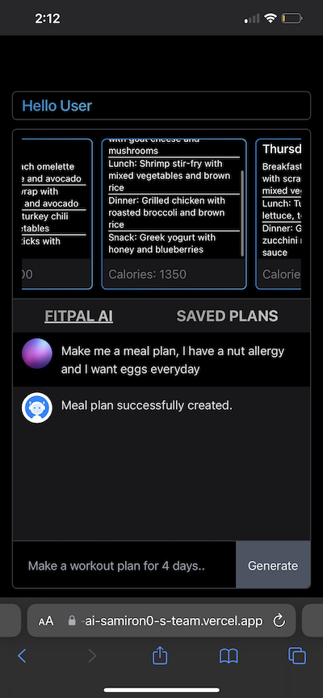

# AI FTINESS PAL

A software service for making custom meal plans by querying the OPENAI API.

## Features

- Secure user management and authentication with [Supabase](https://supabase.io/docs/guides/auth)
- Powerful data access & management tooling on top of PostgreSQL with [Supabase](https://supabase.io/docs/guides/database)

## Demo

-  https://fitpal-ai-samiron0-s-team.vercel.app

## Architecture

